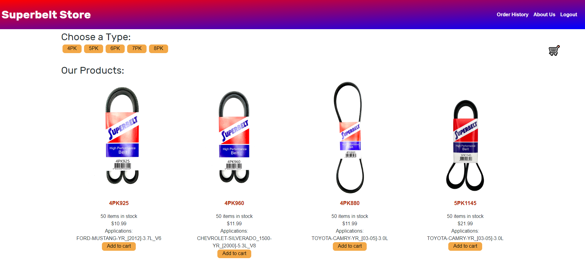

# Superbelt Store

The objective is to build an ecommerce shop for a company so that they can offer and sell their products online.

## USER STORY

AS A developer 

I WANT to create an e-commerce platform for a small business  
SO THAT their clients can have access to their catalog and the option to purchase their products  

## ACCEPTANCE CRITERIA

GIVEN an e-commerce platform 
WHEN I open my application 
THEN I should see the home page where all products are displayed 
WHEN I click on one of the categories 
THEN I find that the products displayed have been filter to match the category selected 
WHEN I click on one of the products 
THEN the I am re-directed to a detail product page with additional information 
WHEN I click on the back button 
THEN I am taken back to the Home page 
WHEN I click on one of the products "Add to cart" button 
THEN the cart opens and displays the added product inside shopping cart 
WHEN click on the Signup option in Nav 
THEN I am re-directed to a Signup page where I can input my information and create user 
WHEN I click on Login option in Nav 
THEN I am re-directed to the Login page, where I can input my credentials to log in 
WHEN I click on the About option in Nav 
THEN I am re-directed to the About page, where I can read more about the company 

WHEN I click on the cart 
THEN I find that I can Checkout my shopping cart 
WHEN I click on checkout 
THEN I am re-directed to a stripe checkout page to input credit card for payment 
WHEN I click on Order History in Nav 
THEN I am re-directed to an Orders page where I can view my past orders 
WHEN I click on the Install button 
THEN I download my web application as an icon on my desktop 
WHEN I load my web application 
THEN I should have a registered service worker using workbox 
WHEN I register a service worker 
THEN I should have my static assets pre cached upon loading along with subsequent pages and static assets 

## Click [here](https://github.com/dolivafig/Superbelt) to see the repo on gitHub.
